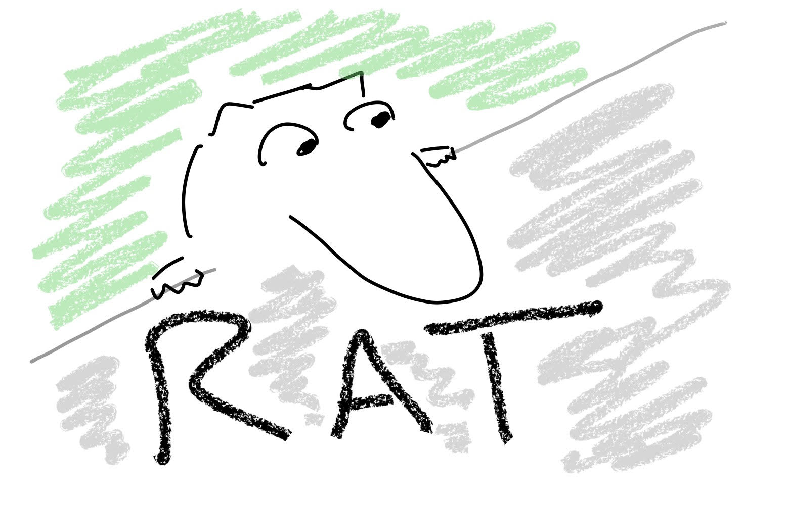

This is an experimental regression package, Rat. Package documentation is [here](https://bbbales2.github.io/regressions/rat.html)



# Developing

To develop with this package, run:

```
pip install -e .
```

in the root directory. This installs the package in editable mode (so can edit
the files and then test without reinstalling).

Code is all stored in the

## Tests

Tests are stored in the tests folder:
```
tests/unit         # tests for individual functions/classes
tests/integration  # end-to-end/everything tests
```

In general, unit tests should be quick/simple stuff, and the integration tests
are the big nebulous ones.

Run tests with:

```
pytest tests                   # All tests
pytest tests/unit              # Just unit tests
pytest tests/integration       # Just integration tests
```

## Formatting

Formatting is handled with [black](https://github.com/psf/black) and can be
run manually with:

```
black --line-length 140 .
```

This is run automatically on PRs via Github actions, so if you push without
formatting you'll need to pull any formatting changes before you pushing again.

## Docs

Docs are handled with [pdoc](https://pdoc.dev/) and can be re-generated with
the command:

```
pdoc --math -o docs rat
```

Docs are regenerated automatically on PRs via Github actions so it isn't
necessary to always regenerate these locally.